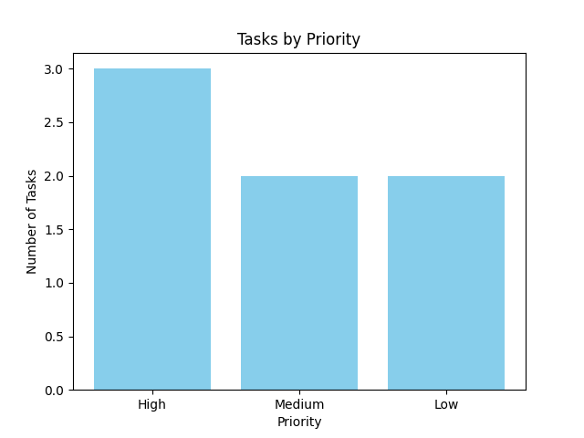
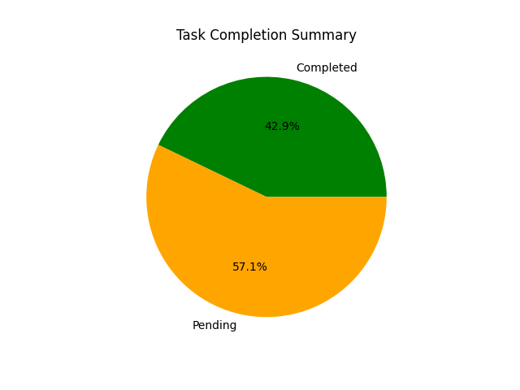

# Personal Task Manager (CLI App)

This is a command-line Task Manager built with Python. It allows users to create, manage, and track tasks with priorities, due dates, and completion status. It also includes automatic CSV export for completed tasks, data visualizations using matplotlib, and a daily summary scheduler.

This project is designed using object-oriented principles and is a great example of how Python can be used to build real-world tools with clean structure and modular design.

---

## Features

- Add new tasks with title, description, due date, and priority
- View all tasks, tasks due today, or completed tasks
- Mark tasks as completed
- Delete tasks by title
- Store tasks persistently using a JSON file
- Export completed tasks automatically to CSV
- Visualize task data using matplotlib charts
- run daily automated task summaries using Python's `schedule` library

---

## Project Visualizations

The following charts help visualize task progress and structure. These images are stored in the `images/` folder and are generated automatically using `visualize.py`.

### 1. Task Completion Summary

This pie chart displays the ratio of completed versus pending tasks.



### 2. Task Priority Distribution

This bar chart shows how tasks are distributed based on priority (Low, Medium, High).



---

## What I Learned

This project helped reinforce several key Python concepts, including:


- Object-oriented programming (custom classes)
- Working with JSON and CSV for persistent data
- Modular code and reusable utilities
- Input validation and basic error handling
- CLI design for real-world use cases
- Data visualization with `matplotlib`
- Automating workflows with the `schedule` library

---

## How to Run This Project

### 1. Clone the repository

```bash
git clone https://github.com/jaybhadiyadra4/task_manager.git
cd task_manager

### 2. Install required packages

pip install matplotlib schedule

### 3. Run the main task manager

python main.py

### 4. View the visualizations

python visualize.py

### 5. Start the daily summary scheduler

python scheduler.py


## File Structure

task_manager/
├── data/
│   ├── tasks.json               # Task storage file (auto-created)
│   └── completed_tasks.csv      # Completed task log (auto-generated)
├── charts/
│   ├── completion_status.png
│   └── priority_distribution.png
├── main.py                      # Main CLI interface
├── manager.py                   # Task management logic
├── models.py                    # Task class definition
├── visualize.py                 # Visualization logic
├── scheduler.py                 # Daily summary logic
├── utils.py                     # Utility functions (load/save/export)
└── README.md                    # Project documentation


## Technologies Used

Python 3.11+

Matplotlib (for data visualization)

Schedule (for automating daily summaries)

JSON & CSV (for data persistence)

Python standard libraries (datetime, os, json, etc.)


## License

This project is open-source and available under the MIT License.


## Author

Jay Bhadiyadra
(https://github.com/jaybhadiyadra4)


